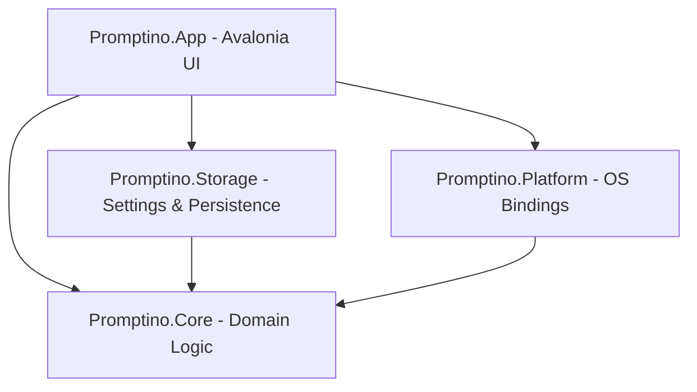

# System Architecture Overview

This document describes the architectural design and structural layers of Promptino.

## System Overview

Promptino is designed with a layered architecture to decouple UI rendering, platform bindings, storage logic, and core playback algorithms.

---

## Architecture Layers

### 1. Presentation Layer (Promptino.App)
The user interface layer is built with Avalonia UI. It follows the Model-View-ViewModel (MVVM) design pattern and contains the following windows:
- **MainWindow**: The main controller panel where users load scripts, calibrate reading speeds (WPM), adjust style settings, edit profiles, and configure shortcuts.
- **PrompterWindow**: The transparent overlay window that displays the scrolling script. Supports horizontal mirroring, margin adjustments, reading guidelines, and customizable color presets.
- **RemoteMiniWindow**: A secondary compact controller designed to float on top during calls, offering speed controls, marker navigation, and play/pause options.

Also handles dynamic localization resources located under `Assets/Locales/` which hot-swaps language resource dictionaries at runtime.

### 2. Core Domain Layer (Promptino.Core)
The core business logic layer is completely independent of the UI framework. It manages state and calculation models:
- **PlaybackSession**: Computes text positioning, layout offset updates, dynamic speed interpolation, and marker bounds.
- **ScriptDocument**: Represents the parsed script, maintaining paragraph lines, ordered markers, and text styling options.
- **ScriptTextTransformer**: Preprocesses text to remove telemetry tags, metadata headers, or inline format notations.

### 3. Platform Layer (Promptino.Platform)
Implements OS-specific bindings and hardware communication:
- **GlobalHotkeyService**: Uses native Windows Win32 API functions (`RegisterHotKey` / `UnregisterHotKey`) to capture keyboard gestures globally, allowing controls even when the application window is unfocused.
- **WindowPriorityService**: Controls overlay window properties like transparency click-through, topmost states, and DWM compositor settings.
- **ScriptWatcher**: Monitors file modification events using filesystem notifications to trigger automatic script reloads when an external editor modifies files.

### 4. Storage Layer (Promptino.Storage)
Handles local settings serialization and state preservation in JSON format:
- **AppSettingsStore**: Manages preferences, themes, hotkeys, window bounds, and active language choice.
- **ProfileStore**: Saves custom text size, color, speed, and spacing presets as reusable profiles.
- **RecentFilesStore**: Keeps a history of recently opened script files.
