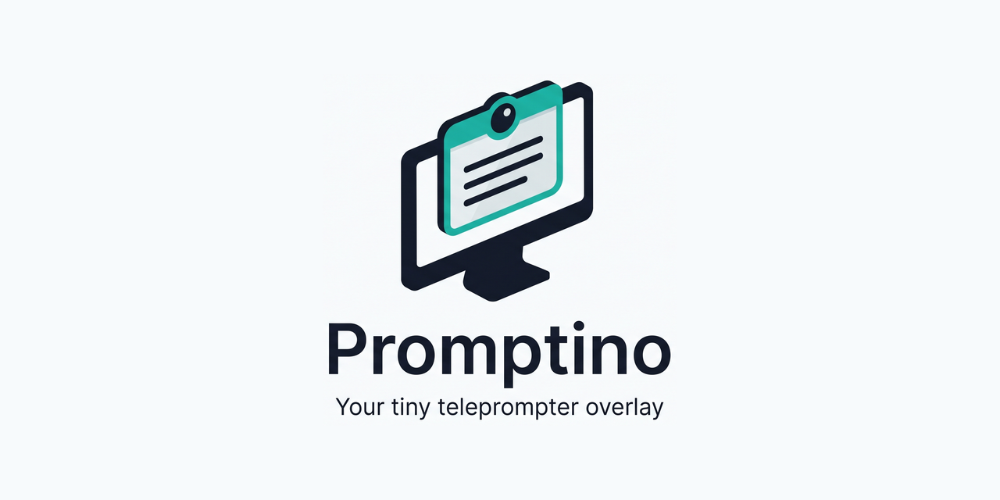
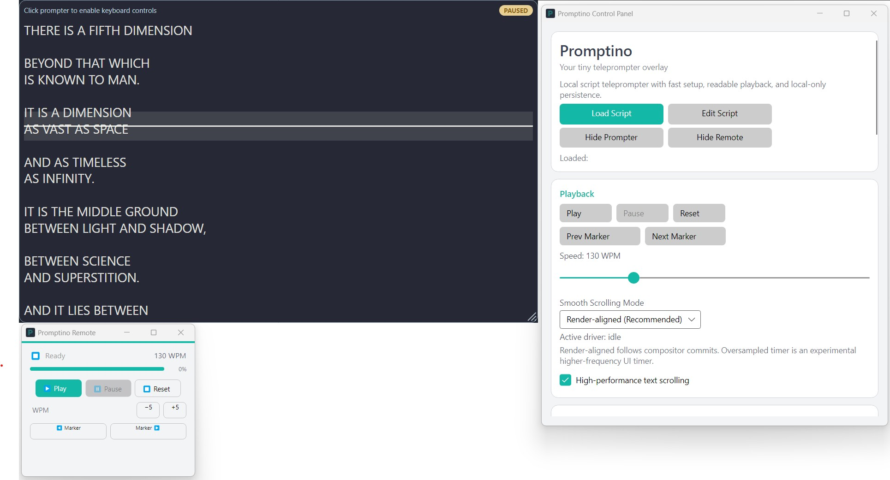

# Promptino

<p align="center">
  
</p>

<p align="center">
  <a href="https://github.com/lorenzoperrone/promptino/actions/workflows/ci.yml"></a>
  <a href="https://github.com/lorenzoperrone/promptino/releases/latest"></a>
  <a href="LICENSE"></a>
</p>

<p align="center">
  <a href="https://github.com/lorenzoperrone/promptino/releases/latest"><strong>Download Promptino for Windows</strong></a>
  ·
  <a href="https://github.com/lorenzoperrone/promptino/wiki">Documentation</a>
</p>

Promptino is a lightweight, clean, and customizable overlay teleprompter designed for video calls, presentations, and screen sharing. It floats above your active windows with adjustable transparency, allowing you to read your script smoothly while keeping eye contact with your camera.

## Preview

<p align="center">
  
</p>

## Key Features

- **Floating Overlay**: Stays on top of active windows with adjustable opacity, size, and reading margins.
- **Stage Directions & Speaker Highlighting**: Automatic formatting for cues `(pausa 3s)`, `[applausi]`, and speaker labels `[HOST]:` with distinct badge styling.
- **Mouse Click-Through Mode**: Toggle interactive transparency (`WS_EX_TRANSPARENT`) to click directly through the prompter to underlying Zoom, Teams, or OBS controls.
- **Multi-Monitor & Borderless Fullscreen**: Select target display for the prompter overlay with borderless fullscreen support.
- **Presentation Timer**: Onscreen speech duration counter and countdown timer with color alerts (amber/red) when nearing your time target.
- **Subtitle & Marker Jump**: Load `.srt` and `.vtt` subtitles or custom `[[marker:Label]]` tags with instant marker navigation and ANSI/Windows-1252 auto-detection.
- **Reading Guide**: Highlighting line and background bands to help keep your place.
- **Dynamic Speed Calibration**: Set speed in Words Per Minute (WPM) with easy speed adjustments during playback.
- **Remote Controller**: A compact remote window that lets you start, pause, reset, or skip between script markers.
- **Global Hotkeys**: Control the teleprompter with keyboard shortcuts even when the window is not focused.
- **Color Presets**: Multiple aesthetic themes including Dracula, Nord, Solarized, Monokai, and High Contrast.
- **Bilingual Interface**: Native support for English and Italian, automatically selecting the system language or customizable via settings.
- **Privacy First**: Fully local execution, saving configuration and scripts on your device with no external tracking or telemetry.

## Quick Start

1. Open the [latest release](https://github.com/lorenzoperrone/promptino/releases/latest) and download the Windows installer (`Promptino-<version>-setup.exe`).
2. Launch `Promptino.App.exe`.
3. Load a text file containing your script using the main control panel.
4. Set your preferred reading speed, size, and theme.
5. Press Play or use the configured hotkeys to start teleprompting.

## Documentation

- [Wiki Home](https://github.com/lorenzoperrone/promptino/wiki)
- [Installation & Quick Start](https://github.com/lorenzoperrone/promptino/wiki/Installation-and-Quick-Start)
- [User Guide](https://github.com/lorenzoperrone/promptino/wiki/User-Guide)
- [Development & Architecture](https://github.com/lorenzoperrone/promptino/wiki/Development-and-Architecture)
- [Architecture overview](ARCHITECTURE.md)

## Building from Source

### Prerequisites
- .NET 10 SDK
- Windows OS (designed for win-x64 platform)

### Build Commands
To run the project in development mode:
```powershell
dotnet run --project Promptino.App/Promptino.App.csproj
```

To compile a production-ready, self-contained single executable:
```powershell
dotnet publish Promptino.App/Promptino.App.csproj -p:PublishProfile=win-x64-release
```
The compiled outputs will be located under `Promptino.App/bin/Release/net10.0/publish/win-x64/`.

## License

This project is licensed under the MIT License - see the LICENSE file for details.

---

From Turin, with love 🍫 and a lot of trial & error.
