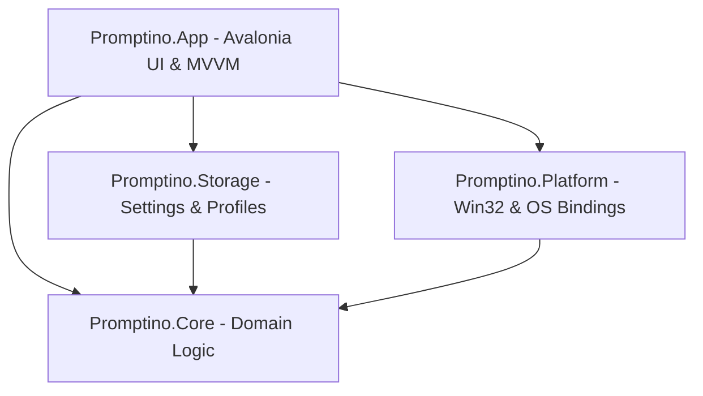

# Development & Architecture Guide

This document provides developer documentation for building Promptino from source, running tests, understanding solution architecture, and packaging releases.

---

## 🏛️ Layered Solution Architecture

Promptino enforces strict 4-layer isolation boundaries to guarantee testability, maintainability, and clean separation of concerns.



### Layer Responsibilities

1. **`Promptino.App` (Avalonia 12 Desktop Application)**
   * Follows MVVM (Model-View-ViewModel).
   * Views (`MainWindow`, `PrompterWindow`, `RemoteMiniWindow`).
   * Compiled bindings enabled (`<AvaloniaUseCompiledBindingsByDefault>true</AvaloniaUseCompiledBindingsByDefault>`).
   * Dynamic resource dictionary localization hot-swapping (`App.SetLanguage()`).

2. **`Promptino.Core` (Core Business & Script Domain)**
   * Independent domain library (zero Avalonia or Win32 dependencies).
   * `PlaybackSession`: Time-delta based scroll progress, WPM clamping, marker jumping.
   * `ScriptTextTransformer`: High-performance regex pipeline stripping Markdown noise, blockquotes, code blocks.
   * `ScriptMarkerParser`: Marker extraction (`[[marker:Label]]`) and SRT subtitle parsing.

3. **`Promptino.Platform` (OS Bindings & Win32 Interop)**
   * `GlobalHotkeyService`: Win32 `RegisterHotKey` loop using STA thread and `MsgWaitForMultipleObjectsEx`.
   * `WindowPriorityService`: `SetWindowDisplayAffinity` display privacy protection.
   * `WindowClickThroughService`: `WS_EX_TRANSPARENT` window style manipulation.
   * `ScriptWatcher`: Debounced `FileSystemWatcher` for external script modification tracking.
   * `FileLogger`: Thread-safe file logging with privacy path sanitization (`%APPDATA%`, `%USERPROFILE%`).

4. **`Promptino.Storage` (JSON Persistence & Profile Storage)**
   * `AppSettingsStore`: Crash-safe atomic save pattern (`.tmp` file write + replace).
   * `ProfileStore`: Named reading style & color preset persistence.
   * `RecentFilesStore`: History tracking for recently opened scripts.

---

## 🛠️ Building & Running Locally

### Prerequisites
* **SDK**: [.NET 10 SDK](https://dotnet.microsoft.com/download)
* **IDE**: Visual Studio 2022 / Rider / VS Code with C# Dev Kit.
* **Solution File**: `Promptino.slnx` (XML solution format).

### Useful Development Commands

```powershell
# Restore dependencies and run in development mode
dotnet run --project Promptino.App/Promptino.App.csproj

# Run test suite
dotnet test Promptino.App.Tests/Promptino.App.Tests.csproj

# Run test suite with verbose output
dotnet test Promptino.App.Tests/Promptino.App.Tests.csproj -v n

# Build self-contained release executable
dotnet publish Promptino.App/Promptino.App.csproj -p:PublishProfile=win-x64-release

# Run full packaging release script (publishes + builds ZIP/SHA256)
.\build-release.ps1
```

---

## 🧪 Testing & Architectural Verification

Promptino uses **xUnit** and **FluentAssertions**.

### Architectural Boundary Enforcer (`ArchitectureBoundaryTests.cs`)
Boundary rules are enforced via reflection in `ArchitectureBoundaryTests.cs`:
* `Promptino.Core` must **NEVER** reference Avalonia, System.Xaml, or Win32 interop APIs.
* `Promptino.Storage` must **NEVER** reference Avalonia or Win32 APIs.
* `Promptino.Platform` must **NEVER** depend on `Promptino.App`.

### Privacy Boundary Verification (`PrivacyBoundaryTests.cs`)
Enforces path sanitization in logs and verifies no telemetry endpoints or telemetry namespaces exist in code.
